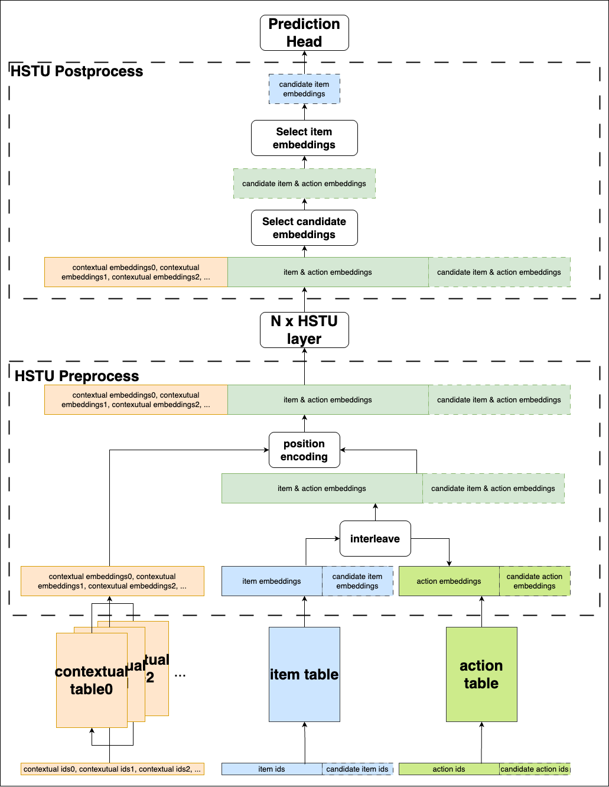
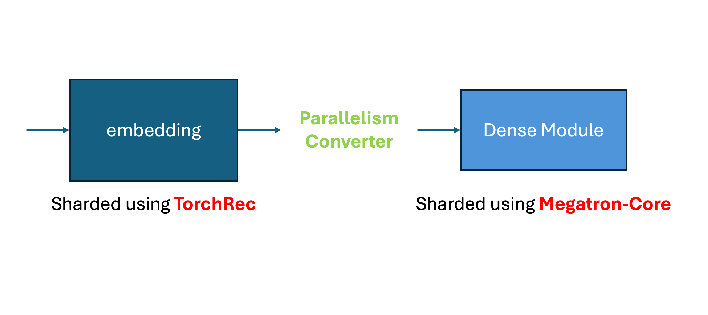

# Examples: to demonstrate how to train generative recommendation models

## Generative Recommender Introduction
Meta's paper ["Actions Speak Louder Than Words"](https://arxiv.org/abs/2402.17152) introduces a novel paradigm for recommendation systems called **Generative Recommenders(GRs)**, which reformulates recommendation tasks as generative modeling problems. The work introduced Hierarchical Sequential Transduction Units (HSTU), a novel architecture designed to handle high-cardinality, non-stationary data streams in large-scale recommendation systems. HSTU enables both retrieval and ranking tasks. As noted in the paper, “HSTU-based GRs, with 1.5 trillion parameters, improve metrics in online A/B tests by 12.4% and have been deployed on multiple surfaces of a large internet platform with billions of users.”
While **distributed-recommender** supports both retrieval and ranking use cases, in the following sections, we will guide you through the process of building a generative recommender for ranking tasks.

## Ranking Model Introduction
The model structure of the generative ranking model can be depicted by the following picture.


### Input
The input to the HSTU model consists solely of pure categorical features, and it does not accommodate numerical features. The model supports three types of tokens:
* Contextual Tokens: Represent the user side info.
* Item Tokens: Represent the items being recommended.
* Action Tokens: Optional. Represent user actions associated with these items. Please note that if a user has multiple actions associated with a single item token, these actions must be merged into a single token during data preprocessing. For further details, please refer to [the related issue](https://github.com/facebookresearch/generative-recommenders/issues/114).

It is crucial that the number of item tokens matches the number of action tokens. This alignment ensures that each item can be effectively paired with its corresponding user action, as the paper said.

### Embedding Table
The embedding mechanism includes three types of distinct tables:
* Contextual Embedding Table: Corresponds to contextual tokens.
* Item Embedding Table: Corresponds to item tokens.
* Action Embedding Table: Corresponds to action tokens if provided.

### HSTU Block
The HSTU block is a core component of the architecture, which modifies traditional attention mechanisms to effectively handle large, non-stationary vocabularies typical in recommendation systems. 
* **Preprocessing**: After retrieving the embedding vectors from the tables, the HSTU preprocessing stage follows. If action embeddings are provided, the model interleaves the item and action embedding vectors. It then concatenates the contextual embeddings with the interleaved item and action embeddings, ensuring that each sample starts with contextual embeddings followed by item and action sequence pairs. Finally, the model applies position encoding.

* **Postprocessing**: If candidate items are specified, the model predicts only these candidates by filtering candidate item embeddings in the postprocessing. Otherwise, all item embeddings will be selected to be used for prediction.

### Prediction Head
The prediction head of the HSTU model employs a MLP network structure, enabling multi-task predictions. 

## Parallelism for HSTU-based Generative Recommender
Scaling is a crucial factor for HSTU-based GRs due to their demonstrated superior scalability compared to traditional Deep Learning Recommendation Models (DLRMs). According to the paper, while DLRMs plateau at around 200 billion parameters, GRs can scale up to 1.5 trillion parameters, resulting in improved model accuracy.

However, achieving efficient scaling for GRs presents unique challenges. Existing libraries designed for large-scale training in LLMs or recommendation systems often fail to meet the specific needs of GRs:
* **[Megatron-LM](https://github.com/NVIDIA/Megatron-LM)**, which supports advanced parallelism (e.g Data, Tensor, Sequence, Pipeline, and Context parallelism), is not well-suited for recommendation systems due to their reliance on massive embedding tables that cannot be effectively handled by existing parallelism.
* **[TorchRec](https://github.com/pytorch/torchrec)**, while providing solutions for sharding large embedding tables across GPUs, lacks robust support for dense model parallelism. This makes it difficult for users to combine embedding and dense parallelism without significant design effort

To address these limitations, a hybrid approach combining sparse and dense parallelism is introduced as the pic shows.
**TorchRec** is employed to shard large embedding tables effectively.
**Megatron-Core** is used to support data and context parallelism for the dense components of the model. Please note that context parallelism is planned as part of future development.
This integration ensures efficient training by coordinating sparse (embedding) and dense (context/data) parallelisms within a single model.



## Dataset Introduction

We have supported several datasets as listed in the following sections:

### Dataset Information
#### **MovieLens**
refer to [MovieLens 1M](https://grouplens.org/datasets/movielens/1m/) and [MovieLens 20M](https://www.kaggle.com/datasets/grouplens/movielens-20m-dataset) for details.
#### **KuaiRand**

| dataset       | # users | seqlen max | seqlen min | seqlen mean | seqlen median | # items    |
|---------------|---------|------------|------------|-------------|---------------|------------|
| kuairand_pure | 27285   | 910        | 1          | 1           | 39            | 7551       |
| kuairand_1k   | 1000    | 49332      | 10         | 5038        | 3379          | 4369953    |
| kuairand_27k  | 27285   | 228000     | 100        | 11796       | 8591          | 32038725   |
 
refer to [KuaiRand](https://kuairand.com/) for details.

## Running the examples

Before getting started, please make sure that all pre-requisites are fulfilled. You can refer to [Get Started][../../README] section in the root directory of the repo to set up the environment.

### Dataset Preprocessing
We provides preprocessor scripts to assist in downloading raw data if it is not already present. It processes the raw data into csv files.
```bash
mkdir -p ./tmp_data && python3 data/preprocessor.py --dataset_name <dataset-name>
```
The following dataset-name is supported:
* ml-1m
* ml-20m
* kuairand-pure
* kuairand-1K
* kuairand-27K
* all: preprocess all above datasets


### Start training
The entrypoint for training are `pretrain_gr_retrieval.py` or `pretrain_gr_ranking.py`. We use gin-config to specify the model structure, training arguments, hyper-params etc.
To run retrieval task with `MovieLens 20m` dataset:

```bash
# Before running the `pretrain_gr_retrieval.py`, make sure that current working directory is `hstu`
PYTHONPATH=${PYTHONPATH}:$(realpath ../) torchrun --nproc_per_node 1 --master_addr localhost --master_port 6000  pretrain_gr_retrieval.py --gin-config-file movielen_retrieval.gin
```

To run ranking task with `MovieLens 20m` dataset:
```bash
# Before running the `pretrain_gr_ranking.py`, make sure that current working directory is `hstu`
PYTHONPATH=${PYTHONPATH}:$(realpath ../) torchrun --nproc_per_node 1 --master_addr localhost --master_port 6000  pretrain_gr_ranking.py --gin-config-file movielen_ranking.gin
```

# Acknowledgements

We would like to thank Yueming Wang (yuemingw@meta.com) and Jiaqi Zhai(jiaqiz@meta.com) for their guidance and assistance with the paper Action Speaks Louder Than Words during our efforts to understand the algorithm and reproduce the results. We also extend our gratitude to all the authors of the paper for their contributions and guidance. In addition, we would like to express special thanks to developers of [generative-recommenders](https://github.com/facebookresearch/generative-recommenders) that we have referenced. 
